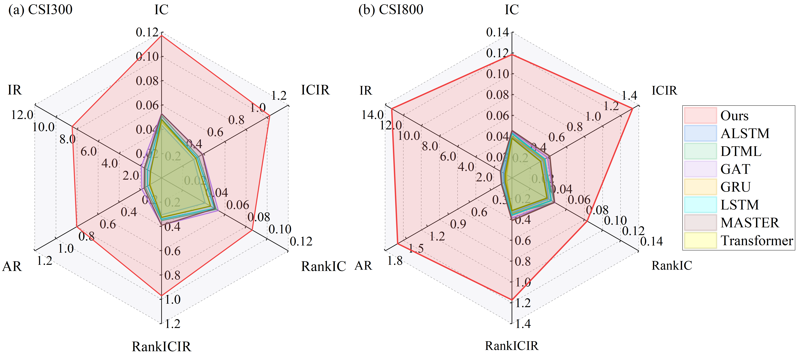
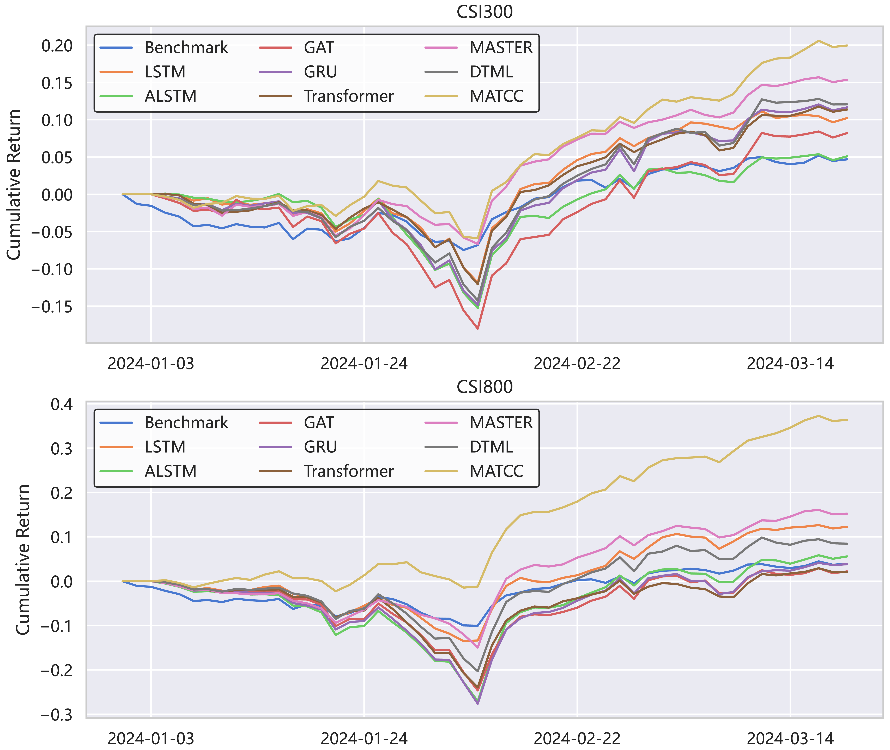
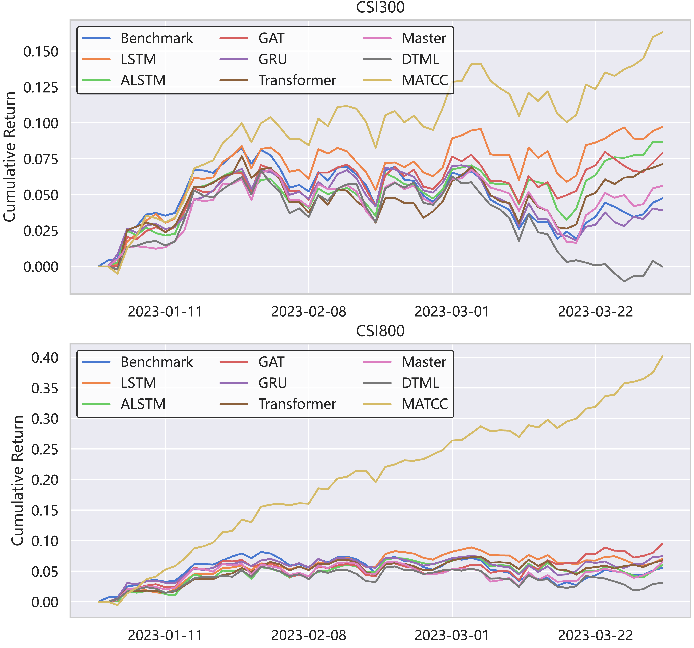

# CIKM2024-MATCC: A Novel Approach for Robust Stock Price Prediction Incorporating Market Trends and Cross-time Correlations

This repository is the official implementation of **MATCC: A Novel Approach for Robust Stock Price Prediction Incorporating Market Trends and Cross-time Correlations**.

MATCC is a novel framework for robust stock price prediction, which explicitly extracts market trends as guiding information, decomposes stock data into trend and fluctuation components, and employs a carefully designed structure for mining cross-time correlation.


## Requirements

1. Install dependencies.

- pandas == 1.5.3
- torch == 1.13.0

2. Install [Qlib](https://github.com/SJTU-Quant/qlib). We recommend you to install Qlib from SJTU-Qlib.

3. Get the CSI300 and CSI800 stock instruments from [Qlib dataset update](https://github.com/chenditc/investment_data/releases) and put it in your qlib data directory.

4. Use the dataset we have provided. You can follow the link to get our preprocessed dataset [2020_2023](https://pan.baidu.com/s/15gt3FcnwqTBAy5oPbzhOsA?pwd=1234). If you fail to download from our link, you may try to use datasets from [MASTER](https://github.com/SJTU-Quant/MASTER).

5. If you want to design and implement your own data preprocessing methods, please refer to `util/DropExtremeLabel.py`. If you want to change the period of the train/validation/test dataset, please modify `util/2023.yaml`. To get CSI300 or CSI800, just change the `market` in `util/2023.yaml` and `universe` in `util/generate_dataset.py`. Run the following commmand:

```
python util/generate_dataset.py --universe csi300
```

### Preprocessing

The published data went through the following necessary preprocessing.

1. Drop NA features, and perform **robust daily Z-score normalization** on each feature dimension.
2. Drop NA labels and 5% of the most extreme labels, and perform **daily Z-score normalization** on labels.

## Training

To train the model in the paper, run this command:

```train
python train_model_MATCC.py
```

## Evaluation

To evaluate my model on CSI300 or CSI800 dataset, you can change the `universe` and `model_param_path` in `test_model_MATCC.py` and run:

```eval
python test_model_MATCC.py
```

Then you will get `xxxxx_label.pkl` and `xxxxx_pred.pkl`, which are the prediction results and labels.

## Backtest

To get the AR, IR, and more portfolio-based metrics, you can run this command:

```backtest
python backtest.py
```

## Results

### Overall performance

Our model achieves the following performance on CSI300 (**2020.07 - 2023.12.31**):

| Model name  | IC              | ICIR            | RankIC         | RankICIR        | AR              | IR              |
| ----------- | --------------- | --------------- | -------------- | --------------- | --------------- | --------------- |
| Ours        | **0.117242833** | **1.024316702** | **0.08575864** | **0.870096253** | **0.803259517** | **8.466878624** |
| MASTER      | 0.053792434     | 0.396283874     | 0.054635386    | 0.39024223      | 0.195310604     | 1.930453898     |
| DTML        | 0.051088842     | 0.35034742      | 0.051845797    | 0.351184897     | 0.154697641     | 1.537347888     |
| Transformer | 0.048012156     | 0.323552332     | 0.046412452    | 0.324412535     | 0.113665438     | 1.036304061     |
| ALSTM       | 0.043422655     | 0.304667419     | 0.041286052    | 0.303555486     | 0.110967154     | 1.092517725     |
| LSTM        | 0.048424638     | 0.336684621     | 0.050138655    | 0.340297238     | 0.132869265     | 1.336330359     |
| GAT         | 0.05297247      | 0.388511199     | 0.053731579    | 0.388697025     | 0.187204099     | 1.914184519     |
| GRU         | 0.04625093      | 0.323989797     | 0.046433043    | 0.326022902     | 0.107347975     | 1.048304919     |



### Portfolio Results

Extreme Market environment



Normal Market environment



## Acknowledgement and Reference Repositories

We appreciate the following github repos a lot for their valuable code base or datasets:

- MASTER: https://github.com/SJTU-Quant/MASTER
- AutoFormer: https://github.com/thuml/Autoformer
- DLinear: https://github.com/cure-lab/LTSF-Linear
- RWKV: https://github.com/BlinkDL/RWKV-LM
- Pytorch_linear_WarmUp_CosineAnnealing: https://github.com/saadnaeem-dev/pytorch-linear-warmup-cosine-annealing-warm-restarts-weight-decay
